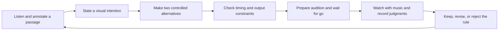

# Studying lighting design for shr-lux

Date: 2026-09-29

Status: researched design brief and learning plan; proposed changes are not implemented.
Tags: #research #design #color #music

## Design brief

Make the band readable, give each passage a coherent visual character, and make
important changes feel earned. A long held look must be a valid result. Motion,
color contrast, darkness and occasional violence are vocabulary, not obligations.

The user liked the composed pad show and accepted the revised scattered white
storm. They rejected a diagnostic layout and a scripted “random” sequence that
looked like a marching squad. These are valuable observations about this user's
taste on this controller, not evidence of stage-scale quality or a universal rule.
Prepare and explain each audition, then wait for the user's **go** before output.

## Read this study in order

1. [Composition and the audience](0021-composition-and-attention.md): what a look is for.
2. [Color, perception and real fixtures](0022-color-and-fixtures.md): why attractive RGB values are insufficient.
3. [Musical time, motion and storms](0023-musical-time-and-motion.md): what changes, when, and why.
4. [Design specification and implementation priorities](0024-design-to-engine.md): changes justified by the study.
5. [Audition laboratory](0025-design-audition-lab.md): how to learn without mistaking activity for quality.
6. [Annotated sources](0026-lighting-study-sources.md): primary references, exact scope read, caveats, and further reading.

For a visual exercise, open the [interactive color study](../research/color-study.html).
It runs locally and changes only when you move a control.

## What changed my view

**Good lighting has a subject.** Rob Koenig's own advice emphasizes the artist,
audience and creative value of limitations. His examples include successful
single-color constraints. We should evaluate whether the performance benefits,
not reward the system for producing more effects.
[Koenig, five lessons](https://chauvetprofessional.com/news/rob-koenig-5-lessons-in-light/).

**A show needs development beyond frame-to-frame reactions.** In Rob Sinclair's
American Utopia account, the lighting follows a longer narrative and blackouts
have a specific purpose. This suggests storing what has already been revealed
and what remains in reserve. His production was tightly staged; our autonomous
system cannot assume that level of advance knowledge.
[Sinclair interview](https://www.livedesignonline.com/theatre/burning-down-house-american-utopia-broadway).

**A restricted palette can carry a whole show.** In another interview Sinclair
describes a largely white Florence and the Machine design with finely differentiated
looks. More hue changes are not a prerequisite for richness.
[Sinclair, Unfinished Light](https://chauvetprofessional.com/news/rob-sinclair-unfinished-light/).

**Our device previews answer different questions.** Controller pads reveal timing
and spatial order. A terminal approximates RGB relationships. Neither establishes
performer visibility, reflected color, audience glare, haze, real dimming or exposure.
The [color note](0022-color-and-fixtures.md) explains the missing measurements.

## Evidence discipline

| Label | Meaning in these notes |
| --- | --- |
| Source finding | A statement supported by material actually opened and read; link nearby |
| Repository observation | Behavior inspected in our code or existing recorded tests |
| User observation | Feedback from this conversation, with the medium and context retained |
| Proposal | Our design choice or experiment; not a quotation or established industry law |
| Unknown | Requires data, equipment, listening or human judgment we do not yet have |

Manufacturer teaching material is useful for optics and operational concepts but
also promotes products. Designer interviews are firsthand accounts of individual
practice, not controlled comparisons. Research papers have specific datasets and
representations. Book catalogue pages establish bibliographic information; they
do not mean the books were read. No full books, films or paid courses were acquired.

## The next learning loop

The best next comparison is a held composition against our automatic motif
rotation on the same passage. Keep the palette, brightness proxy and accents the
same. Then compare the regular paired burst with a bounded storm **in context**.
The standalone storm's approval does not yet justify dropping it into every dense
kick passage.

## Current conclusions

- Spend the next implementation effort on **holding and composing**, before adding patterns.
- Separate performer light, environment and accents so one layer cannot erase the others accidentally.
- Separate color appearance, fixture intensity and effect permission in the data model.
- Treat genre as an artist-selected starting vocabulary. Heavy music can call for spacious stillness.
- Keep uncertainty visible. A kick pulse is not a verified beat; loud guitar is not a solo.
- Use repeatable seeded variation within an intentional envelope. Unrestricted randomness is not design.
- Keep the live engine small. Higher-cost analysis can inform authoring and evaluations offline.

These are proposals grounded in the study and current feedback. The runtime has
not been changed during this research pass, and no simulation or hardware output
was started.

## Research-pass validation

Seven new study notes and an audition worksheet were linked into the notebook,
with 23 annotated sources and three explicitly unread book leads. All 86 checked
local links resolved. `zk index` completed; its warnings concern intentional links
outside the nested notebook. `git diff --check` passed.

The color exercise's JavaScript parsed, and focused numerical checks verified the
128-versus-188 display example, transfer-function round trips, preservation of
white in the linear-light example and its loss in the existing saturated mixer.
The HTML was not visually browser-tested here; Oklab support is detected by the
page. No scientific or photometric validation is implied.

Rust production tests, full-song audits and physical output were intentionally
not run: this pass changes research documents and a standalone display exercise,
not the application. The original `idea.md` remains unchanged.

Related: [original musical research](0015-musical-direction.md),
[current show](0019-composed-pad-show.md), [Pi 1 target](0014-pi1-feasibility.md).

[Notebook index](../index.md)
